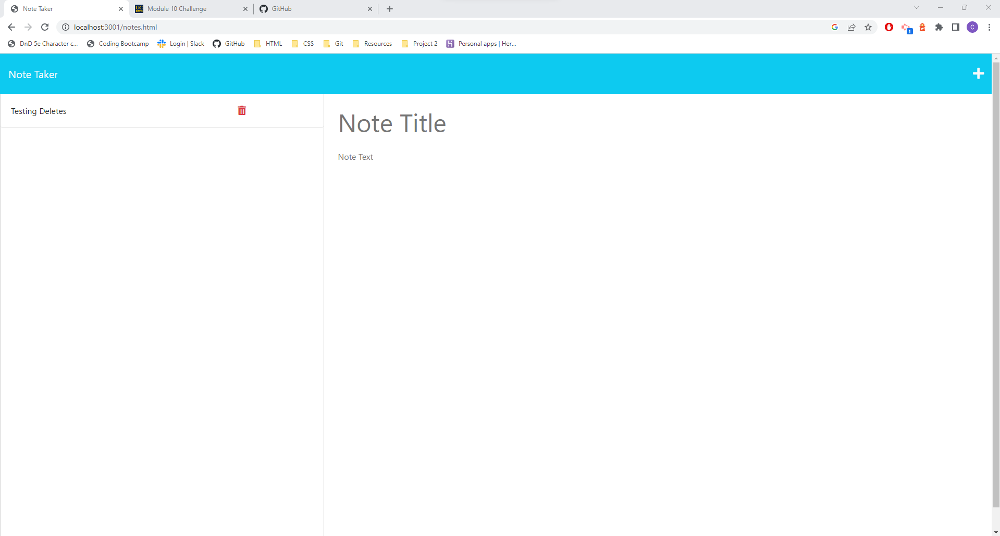

# Note Taker Starter Code

## Badges 

## Description
Use this to save notes for your future self! Useful for the generally forgetful people.

## Built With
- HTML
- CSS
- Javascript
- Express

## Installation
No install needed

## Usage

Visit this web address to see the github deployed page for the repo https://cjmerit.github.io/notebook/

This is an image of the deployed website:

Using chrome as the browser for the web page, right click on it and click inspect to use Chrome DevTools to inspect the HTML and CSS.